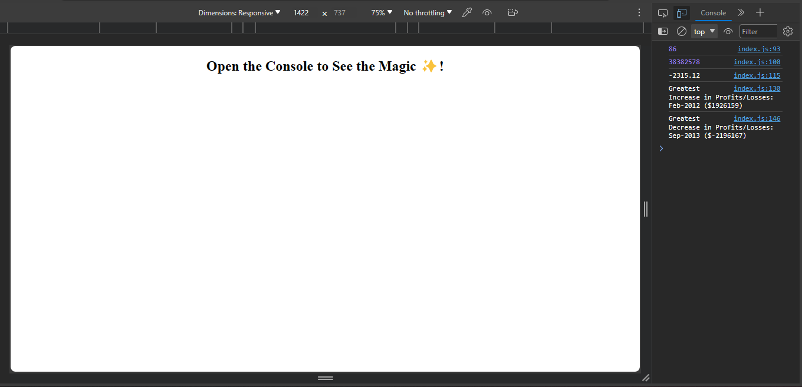

# Unit 4 Challenge: Console Finances

## Table of content 

* [Description](#Description)
* [Installation](#installation)
* [Features](#features)
* [Credits](#credits)
* [License](#license)

## Description 
Console finances projects resents a real-world situation in which JavaScript skills comes in handy. This code has been written for analyzing the financial records of a company. 

## Installation
This project can be installed using the SSH or HTTP key in GitHub (Given one of them has been set up on local machine). The project is in a public repository, so it is easily accessible on GitHub.
1. Navigate to github repository. 
2. Click the clone button on this repo, and copy either the HTTP key or SSH key. 
3. On your local computer, open Visual Studio codes or any code editor of your choice. 
4. Open terminal, create a directory for this project. open the directory. 
5. Then run git clone ssh key or git clone HTTP key
6. All folders and files are now cloned into this directory

## Features
A dataset composed of arrays with two fields: Date and Profit/Losses.

The task is to write JavaScript code that analyzes the records to calculate each of the following:

1. The total number of months included in the dataset.

2. The net total amount of Profit/Losses over the entire period.

3. The average of the changes in Profit/Losses over the entire period.
This is calculated by tracking what the total change in profits is from month to month and then find the average.
(Total/(Number of months - 1))

4. The greatest increase in profits (date and amount) over the entire period.

5. The greatest decrease in losses (date and amount) over the entire period.

The code prints the analysis to the console.

The following image shows the web application's appearance and functionality:

## Credits

Omotoyosi Akingbehin

---
The MIT License (MIT). Copyright (c) .NET Foundation and Contributors. All rights reserved.